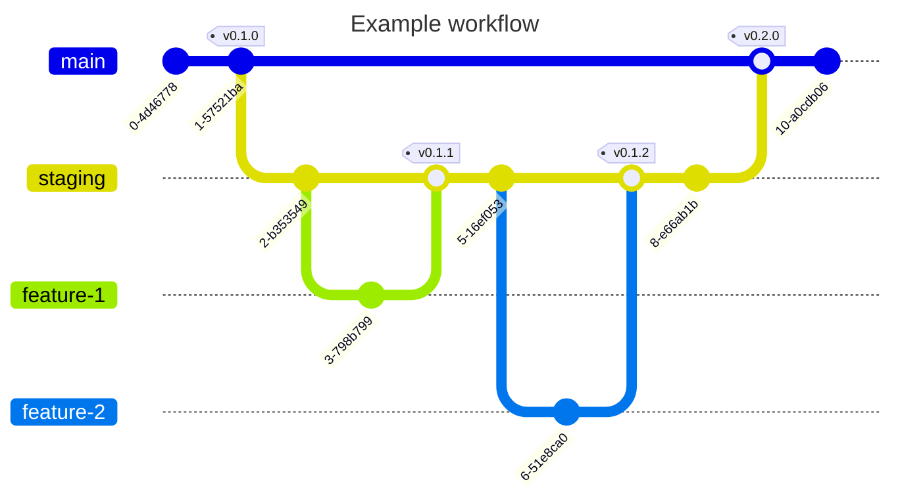

# Personal Website

Hi, this is my personal website!

## Tech Stack

- `nix` to setup the [development machine](#developer-workflow)
- `hugo` for the static website generator framework

## Project Workflow

I'm drafting small issues and pull requests that squash merge into the staging branch.
When I've made significant enough progress, I'll rebase and fast-forward back
the staging branch into main.

## Developer Workflow

### Installation

First, install `nix` from [Determinate
Systems](https://determinate.systems/posts/determinate-nix-installer/). Next,
use [`direnv`](https://direnv.net) to install and load the developer shell with
all the tooling built in.

I recommend using [`neovim`](https://Neovim.io) or
[`vscode`](https://code.visualstudio.com) with the [devcontainer
extension](https://marketplace.visualstudio.com/items?itemName=ms-vscode-remote.remote-containers)
for the text editor.

### Run the Server

Run `hugo serve` to start up the local development web server.

### Contribution

When committing, use
[commitizen](https://commitizen-tools.github.io/commitizen/) to format the
commit title and subtext to ensure
[conventional commits](https://www.conventionalcommits.org/en/v1.0.0/).

Commit hooks set up for [pre-commit](https://pre-commit.com) to ensure
consistent formatting and style.
