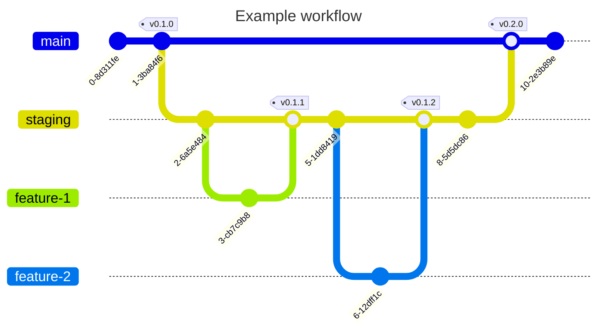

# Personal Website

Hi, this is my personal website!

## Tech Stack

- `nix` to setup the [development machine](#developer-workflow)
- `11ty` as the static site generator
  - See [blog template](https://github.com/11ty/eleventy-base-blog)
- [pnpm](https://pnpm.io) for the package manager
  - [prettier](https://prettier.io) for the general formatter
- Deploying (currently) on [Vercel](https://vercel.com) at
  [sua.sh](https://sua.sh)

## Project Workflow

Currently, I have the production website at [sua.sh](https://sua.sh) and the
preview website at [sua-drafts.vercel.app](https://sua-drafts.vercel.app). The
production website is tied directly to
[main](https://github.com/suasuasuasuasua/personal-website/tree/main), while the
preview website is tied to
[staging](https://github.com/suasuasuasuasua/personal-website/tree/staging).

I'm drafting small issues and pull requests that merge into the staging branch.
When I've made significant enough progress, I'll merge back staging into main.


```mermaid
---
title: Example workflow
---
gitGraph
   commit
   commit tag: "v0.1.0"
   branch staging
   checkout staging
   commit
   branch feature-1
   checkout feature-1
   commit
   checkout staging
   merge feature-1 tag: "v0.1.1"
   commit
   branch feature-2
   checkout feature-2
   commit
   checkout staging
   merge feature-2  tag: "v0.1.2"
   commit
   checkout main
   merge staging tag: "v0.2.0"
   commit
```

TLDR; go to [sua-drafts.vercel.app](https://sua-drafts.vercel.app) for the
latest changes, but you will need to sign into [Vercel](https://vercel.com). Or,
go to the
[staging](https://github.com/suasuasuasuasua/personal-website/tree/staging)
branch, pull the changes, and run `pnpm dev` to start up a local development web
server.

## Developer Workflow

### Installation

Install `nix` from
[Determinate Systems](https://determinate.systems/posts/determinate-nix-installer/).

```bash
curl --proto '=https' --tlsv1.2 -sSf -L https://install.determinate.systems/nix | sh -s -- install
```

Use [`devenv`](https://devenv.sh) and [`direnv`](https://direnv.net) to install
and load the developer shell with all the tooling built in.

I recommend using [`neovim`](https://neovim.io) or
[`vscode`](https://code.visualstudio.com) with the
[devcontainer extension](https://marketplace.visualstudio.com/items?itemName=ms-vscode-remote.remote-containers)
for the text editor.

### Run the Server

Run `pnpm dev` to start up the local development web server.

Alternatively, use `vercel dev` and sign in to start the same server but gain
the ability to interact with Vercel data.

### Contribution

When committing, use
[commitizen](https://commitizen-tools.github.io/commitizen/) to format the
commit title and subtext to ensure
[conventional commits](https://www.conventionalcommits.org/en/v1.0.0/).

There are also a number of commit hooks set up for
[pre-commit](https://pre-commit.com) to ensure consistent formatting and style.

### Deployment

Purchase a domain name from a domain name registrar like
[namecheap](https://www.namecheap.com/). Alternatives include
[Cloudflare](https://www.cloudflare.com/products/registrar/) or
[GoDaddy](https://www.godaddy.com/).

Vercel makes it easy to setup and deploy your `git` project. First, sign up and
connect your GitHub account to Vercel, then create a new Vercel project from one
of your GitHub repositories. Finally, connect the Vercel server's IP address and
domain name by adding an A and CNAME record to your domain under your domain
name provider.

Each commit to `main` will be to the production website, and pushes to other
branches will be to preview websites. See each build and deployment status under
the `deployment` tab.
