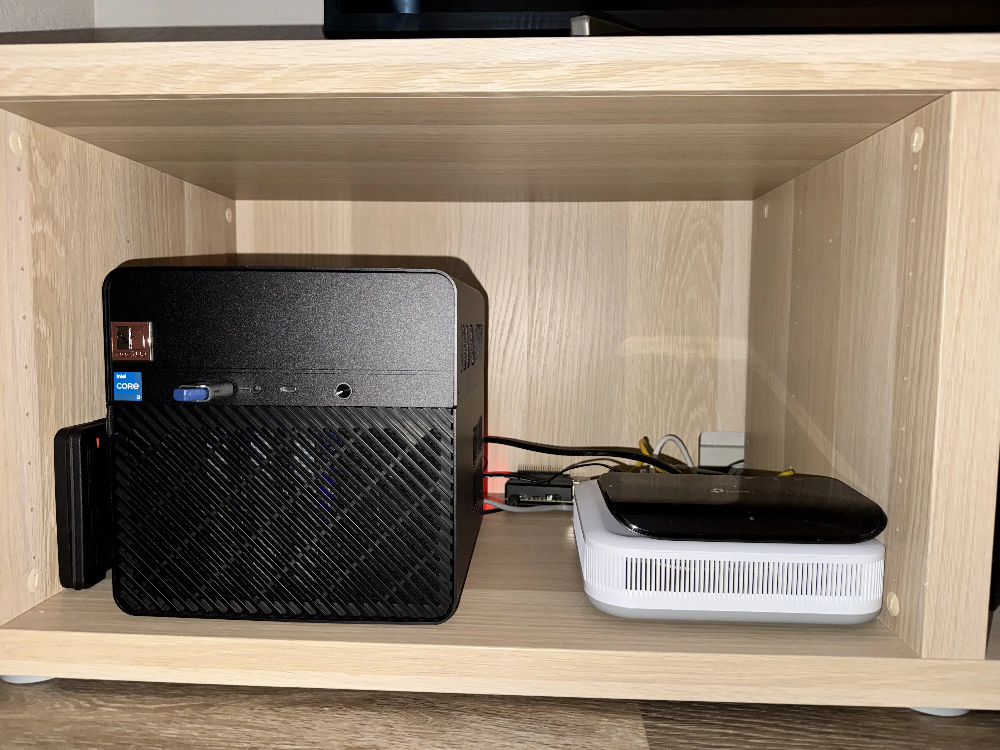
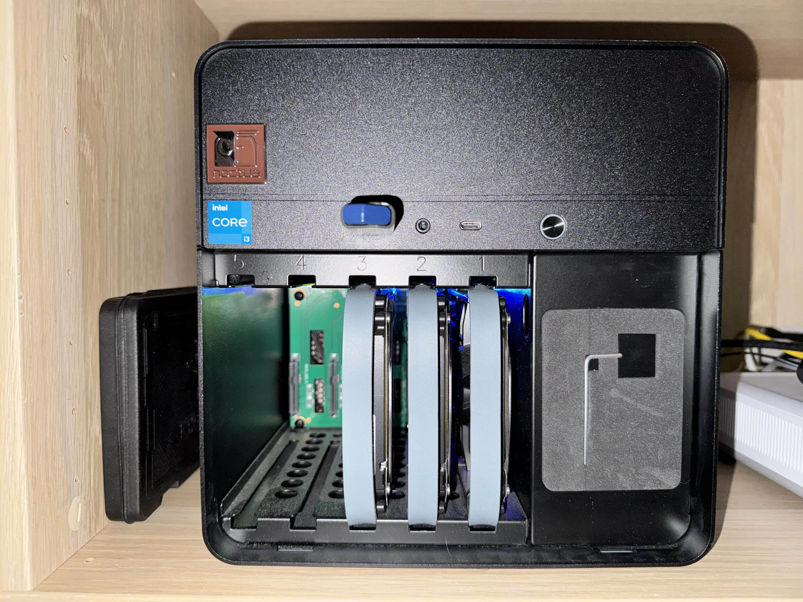

<!--toc:start-->
- [Lab](#lab)
- [Pi](#pi)
<!--toc:end-->

In this post, I'll cover the hardware that I am using for my homelab. This has
been my biggest hobby for the past year. Later in a future post, I'll cover the
operating system(s) that I am running, any interesting self-hosted services, and
future plans.

At the time of writing, my homelab is still very modest, consisting of only two
main computers. No server racks just yet...

> The black server on the left is called "lab". The raspberry pi is in the
> background to the left of the router and switch.

## Lab

This server is the main workhorse. It's my "all in one solution" that
compromises between compute, memory, and storage. I wanted a server that could
function as a NAS, workstation, and more. With the current configuration, the
server idles at around 10W.

> I bought the parts to the server early in January 2025 when parts were still
> pretty cheap. Excluding the storage, the server cost about $600 to build.
>
> The storage was about $400-500 in total between the SSDs and HDDs.

The specs are as follows:

1. Motherboard: ASUS ROG Strix B760-l
   - ITX board
   - Supports modern hardware up to 14th gen CPUs, DDR5 memory, and PCIe 5.0
   - 4 SATA ports (most ITX boards either come with 0 or 2)
2. CPU: i3-14100
   - Low power draw and decent performance
3. RAM: 2x16GB 4800MHz
   - Good amount of memory, but not too overkill
   - Note that memory speed is limited by CPU choice
4. Chassis: Jonsbo N2
   - Mini ITX form factor
   - Built-in HDD/SSD compartments
5. Storage
   - ZFS filesystem for deduplication and redundancy
   - Root filesystem running 2x2TB NVME SSDs (2TB usable)
   - Shared filesystem running 3x4TB HDDs (8TB usable)

> There are five SATA slots, but I have only populated three of them so far.

---

This server runs pretty much everything in my self-hosted service stack.

- Actual
  - Budget tracker
- Mealie
  - Recipe manager
- Navidrome
  - Music manager and streamer
- Wireguard
  - VPN server
- ...

---

I do have a few regrets about the system after a year of using it.

- I should have purchased larger storage, just to be safe from data loss in
future migrations
  - For instance, 8TB HDDs is the minimum size that I should have gone for just
  for its storage density value proposition
  - With my ZFS setup (RAIDz1), I only get 8TB of usable space. If I instead
  went for a mirror with 2x8TB, I would still get the same amount of usable
  space
- I should have bought the 2x32GB memory kit
  - I didn't know that prices for RAM were going to skyrocket, but in retrospect
    that was the perfect time to parts
  - I am only running into memory issues when I try to run larger Ollama models
    like Gemma3
  - I am also experimenting with running three separate [minecraft
  servers](https://github.com/suasuasuasuasua/nixos-config/blob/aad799a2f4a52863c6baaedd5c70ce5182fd20ba/configurations/nixos/lab/services/minecraft-server.nix)
  at the same time. Though I haven't hit any issues yet, I would have better
  peace of mind since these servers can be quite intensive
- The CPU is great, but sometimes I wish it had more power
  - High compute tasks like rebuilding NixOS configurations can take a while
  - With the motherboard choice, I am also locked into 14th gen CPUs
- I still need to setup an offsite backup server (like yesterday)
  - Having everything bundled together in one server means I have one point of
  failure. A power outage or hardware failure could corrupt data
  - Along this point, I probably want to invest in a UPS in case of power
  outages

The exact configuration, at the time of writing, can be [found
here](https://github.com/suasuasuasuasua/nixos-config/blob/aad799a2f4a52863c6baaedd5c70ce5182fd20ba/configurations/nixos/lab/README.md).

## Pi

I am running a standard Raspberry Pi 4b 2GB.

> I originally bought this computer for a college class on building sensor
> systems. The idea was could connect hardware like sensors, buttons, etc. to
> the GPIO pins on the RPI and do cool experiments. At the time in 2021, the Pi
> was about $100, give or take.

Given its hardware limitations, it can only run lightweight services. The
compute is so weak that it can't run NixOS rebuilds on its own. I offload that
work to my other server.

The RPI's reliability and low power draw makes it a perfect candidate for high
availability services.

- Adguard Home
  - Domain Name Server (DNS)
  - Domain based ad-blocking
- DuckDNS DDNS client
  - Dynanmic DNS updater
- iSponsorBlockTV
  - YouTube ad skipper
- Uptime Kuma
  - Service monitoring tool

The exact configuration, at the time of writing, can be [found
here](https://github.com/suasuasuasuasua/nixos-config/blob/aad799a2f4a52863c6baaedd5c70ce5182fd20ba/configurations/nixos/pi/README.md).
